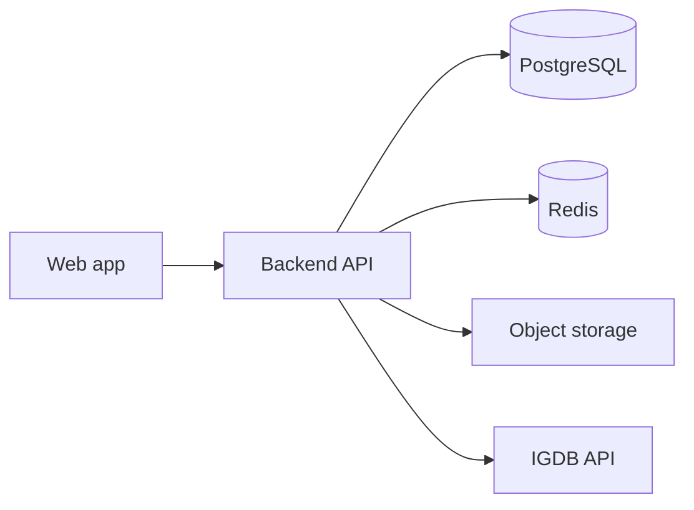

# Technical design: Game list tracker

Companion to the PRD and [product decisions](./decisions.md). Describes **stack**, **IGDB**, **storage**, **schema**, and **API** shape for implementation.

---

## 1. Architecture overview

- **Monolith API first:** Single backend service exposing REST or JSON API (tRPC/GraphQL optional later).
- **BFF pattern optional:** Thin Next.js route handlers proxying to API if client and server share a repo.

---

## 2. Recommended stack

| Layer | Choice | Notes |
|-------|--------|--------|
| **Web UI** | Next.js (App Router) + React | SSR for SEO on public profiles/lists; client components for interactive lists. |
| **Styling** | Tailwind CSS + headless UI (Radix) | Matches “clean, modern” PRD; accessible primitives. |
| **API** | Next.js Route Handlers or separate Node (Fastify/Nest) | If separate service, deploy API + worker together. |
| **Database** | PostgreSQL | Relational model for users, games, lists, entries, routes, follows. |
| **ORM** | Drizzle or Prisma | Migrations required from day one. |
| **Auth** | Better Auth, Lucia, or Auth.js | Email + OAuth (Google, etc.); session in HTTP-only cookie. |
| **Cache** | Redis | Session optional; IGDB search cache; rate limits. |
| **Files** | S3-compatible (AWS S3, Cloudflare R2, MinIO) | Route images, avatars, user-submitted covers. |
| **Hosting** | Vercel + managed Postgres or Fly.io/Railway | Match team preference; IGDB calls from server only. |

---

## 3. IGDB integration

- **Credentials:** Twitch Developer application → Client ID + Client Secret → OAuth **client credentials** flow for app access token; IGDB uses `Client-ID` header + `Authorization: Bearer <token>`.
- **Base URL:** `https://api.igdb.com/v4` (POST with **body** as query string per IGDB docs).
- **Endpoints (typical):**

  - `games` — search with `search "title"; fields name,first_release_date,cover.url,platforms.name,summary; limit 20;`
  - `covers` — if resolving cover ID separately.

- **Server-side only:** Never expose Twitch secret to the browser. Backend route `GET /api/games/search?q=` proxies to IGDB with caching.

- **Caching:** Redis key `igdb:search:{hash(q)}` TTL 24h; per-game `igdb:game:{id}` TTL 7d.

- **Rate limits:** Respect IGDB quotas; debounce client search (300ms); exponential backoff on 429.

- **User-submitted games:** Stored locally with `source = USER` and no `igdbId`; optional `igdbId` null. Merged catalog queries union `Game` rows from API cache and user submissions.

---

## 4. Storage

| Asset | Location | Limits (suggested) |
|-------|----------|---------------------|
| Route reference image | S3 key `users/{userId}/routes/{routeId}/{uuid}.webp` | Max 5 MB; types image/jpeg, image/png, image/webp; server-side resize max 1200px edge |
| Avatar | `users/{userId}/avatar.{ext}` | 2 MB |
| User game cover | `games/user/{gameId}/cover.{ext}` | 5 MB |

**URLs:** Store HTTPS URL after upload or key + signed URL generation on read.

---

## 5. Database schema (logical)

Naming illustrative; adjust to ORM conventions.

### Core

- **users** — id, email, handle (unique), displayName, avatarUrl, bio, createdAt, …
- **games** — id, source (`IGDB` | `USER`), igdbId (nullable unique), title, slug, summary, releaseDate, coverUrl, createdAt, submittedBy (nullable FK users), reportCount, moderationStatus (nullable enum for future)

**Explore / discovery extensions (planned):**

- **Developer:** `developer_name` (text, nullable) or FK to `companies` if normalized; hydrate from IGDB `involved_companies` (developer role) for `source = igdb`; user-submitted games: optional manual value or null → UI “Unknown”.
- **Genres:** `genres` — `jsonb` array e.g. `[{ "id": 12, "name": "Role-playing (RPG)" }]` or junction table `game_genres`; hydrate from IGDB `genres`.
- **IGDB ratings:** `aggregated_rating` (critic, 0–100 scale per IGDB), `aggregated_rating_count`, optional `total_rating` (user) — nullable; refresh on sync from IGDB.
- **User average rating (computed):** `AVG(library_entries.rating)` filtered `rating IS NOT NULL` per `game_id` — not stored, or cached in rollup table for performance.

**Indexes for Explore aggregates:**

- `library_entries(game_id)` — supports `COUNT(DISTINCT user_id)` and user-rating averages per game.
- Optional **materialized view** or periodic job: `game_popularity(game_id, save_count, last_activity_at)` if live aggregates become slow at scale.

### Library (see [decisions](./decisions.md))

- **library_entries** — id, userId, gameId, **unique (userId, gameId)**, status, rating (numeric nullable), notes (text), progressPercent (nullable), progressNote (nullable), updatedAt

### Lists as collections

- **lists** — id, userId, name, slug, visibility (`PUBLIC` | `UNLISTED` | `PRIVATE`), createdAt
- **list_memberships** — listId, libraryEntryId, **unique (listId, libraryEntryId)**, addedAt

### Character routes

- **character_routes** — id, libraryEntryId, name, sortOrder, imageUrl (nullable), status, rating (nullable), notes (text), createdAt  
  - Constraint: count per libraryEntryId soft-capped at 50 in app layer.

### Social (MVP+)

- **follows** — followerId, followingId, createdAt, **unique (followerId, followingId)**
- **activities** (optional table for feed) — id, userId, type (`COMPLETED` | `STARTED` | `RATED` | …), payload JSON, createdAt, libraryEntryId nullable

### Explore (home)

- **Carousel payload:** Server component or `GET` API returning current user’s `library_entries` with `games` + `character_routes` (limit/order per [prd-explore-home.md](./prd-explore-home.md)).
- **Popular grid query:** `SELECT game_id, COUNT(DISTINCT user_id) AS saves, MAX(updated_at) AS last_activity FROM library_entries GROUP BY game_id` joined to `games`, ordered per [decisions.md](./decisions.md) tie-break rules; apply genre filter via `games.genres` containment or join; text search on `title` (and later `tsvector`).

### Indexes

- `library_entries(userId)`, `library_entries(gameId)`
- `games(igdbId)` where not null
- `lists(userId, slug)` unique
- Full-text search on `games.title` (Postgres `tsvector`) optional for user games + cached titles

---

## 6. API outline (REST-style)

Prefixes `/v1`. Auth: Bearer or session cookie.

### Auth

- `POST /auth/register`, `POST /auth/login`, `POST /auth/logout`, `GET /auth/me`

### Catalog

- `GET /games/search?q=&limit=` — IGDB proxy + local user games (fuzzy second phase)
- `GET /games/:id` — merged metadata
- `POST /games` — create user-submitted game (dedup check body)

### Library

- `GET /me/library` — paginated entries with game embed
- `GET /me/library/:entryId` — entry + routes
- `PATCH /me/library/:entryId` — status, rating, notes, progress fields
- `DELETE /me/library/:entryId` — remove entry (and optionally cascade routes)

### Routes

- `POST /me/library/:entryId/routes` — create (enforce 50 cap)
- `PATCH /me/library/:entryId/routes/:routeId`
- `DELETE /me/library/:entryId/routes/:routeId`
- `POST /me/library/:entryId/routes/:routeId/image` — multipart upload → S3

### Lists

- `GET /me/lists`, `POST /me/lists`, `PATCH /me/lists/:id`, `DELETE /me/lists/:id`
- `POST /me/lists/:id/entries` — body `{ libraryEntryId }` add membership
- `DELETE /me/lists/:id/entries/:entryId`

### Social (MVP+)

- `GET /users/:handle`, `GET /users/:handle/lists` (public only)
- `POST /users/:handle/follow`, `DELETE /users/:handle/follow`
- `GET /users/:handle/activity` — public activity for profile

### Explore (home) — illustrative routes

Public or session-aware JSON; names align with Next.js `app/api/...` handlers:

- `GET /api/explore/popular?page=&limit=&genreIds=&sort=` — paginated popular games with save counts, cover, title, developer, genres, rating display fields (critic vs players per [decisions.md](./decisions.md)).
- `GET /api/explore/genres` — distinct genres for filter dropdown (from `games.genres` or taxonomy table).
- `GET /api/explore/me-carousel` (auth required) — library entries + routes for signed-in user for horizontal carousel; **401** if unauthenticated (client shows empty state instead).

**IGDB enrichment:** When syncing or backfilling `games` from IGDB, request `genres`, `involved_companies`, `aggregated_rating`, `first_release_date` in the same pipeline as cover; cache responses per IGDB integration notes above.

**Errors:** JSON `{ error: { code, message } }`; 409 for duplicate game in library, 413 for upload, 429 for rate limit.

---

## 7. Security and compliance

- Validate all inputs; use parameterized queries (ORM).
- CORS restricted to app origin.
- Upload virus scanning optional (post-MVP).
- Account deletion: soft-delete user + schedule purge of S3 objects per privacy policy.

---

## 8. Implementation order

1. DB schema + migrations; auth; `games` search proxy + user game create.
2. `library_entries` + CRUD; lists + memberships.
3. `character_routes` + image upload.
4. Public profile + follow + minimal activity.
5. **Explore home:** extend `games` metadata (genres, developer, IGDB ratings); aggregates + indexes; `/api/explore/*` + `/` UI per [prd-explore-home.md](./prd-explore-home.md).
6. Feed and notifications (Next phase per [social-phases](./social-phases.md)).

---

## References

- [IGDB API documentation](https://api-docs.igdb.com/)
- [Product decisions](./decisions.md)
- [PRD: Explore home](./prd-explore-home.md)
- [Wireframes](./wireframes.md)
- [Social phases](./social-phases.md)
