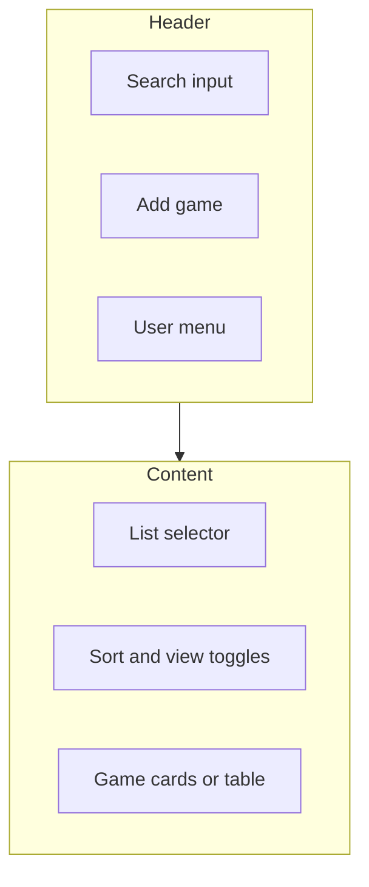
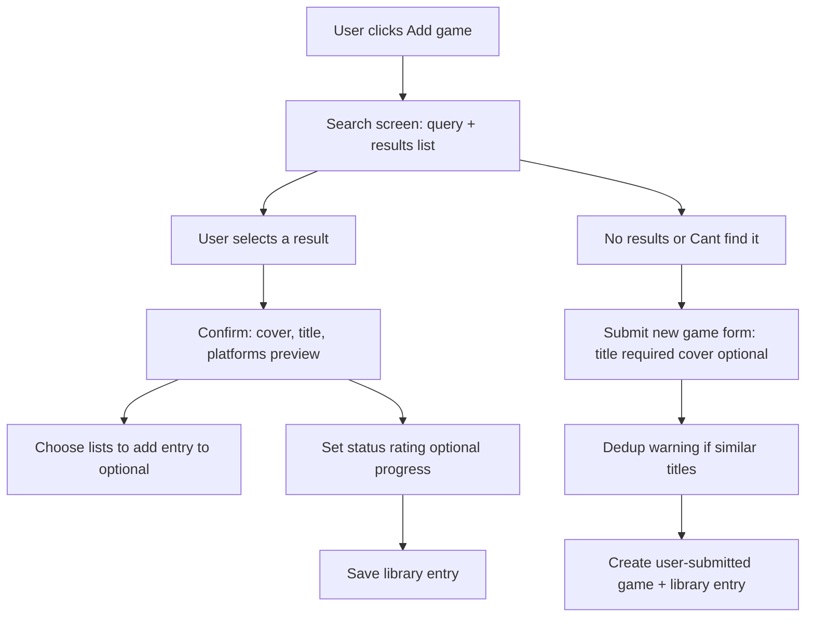
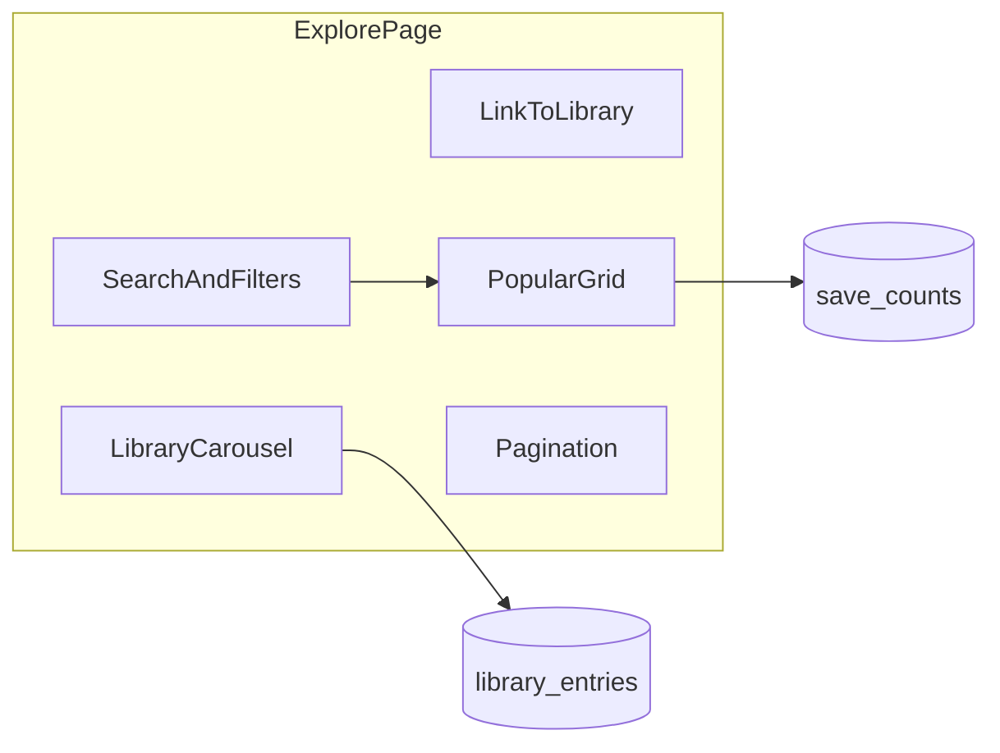

# UX wireframes (low-fidelity)

Low-fidelity layouts for implementation. Spacing and copy are indicative; final visual design follows the PRD UI and design principles section.

---

## 1. List view (library or custom list)

**Purpose:** Scan many games with status, rating, and quick actions.

```
┌──────────────────────────────────────────────────────────────────────────┐
│ [Logo]  Search games…                              [Avatar ▼] [+ Add game] │
├──────────────────────────────────────────────────────────────────────────┤
│ Sidebar (md+)          │  Main                                                  │
│ · All games            │  [List: All games ▼]   Sort: [Title ▼]  View: [Grid|Table] │
│ · Playing              │  ─────────────────────────────────────────────────────  │
│ · Custom: 2026 goals   │  ┌──────┐ ┌──────┐ ┌──────┐                             │
│ · + New list           │  │ cover│ │ cover│ │ cover│   …                       │
│                        │  │Title │ │Title │ │Title │                             │
│                        │  ●Playing│ ●Done │ ●Plan  │   (status chips)           │
│                        │  ★ 8.5 │ ★ 9   │  —     │   (rating)                 │
│                        │  └──────┘ └──────┘ └──────┘                             │
│                        │  Table row alt: [cover thumb] Title | Status | ★ | routes count │
└────────────────────────┴──────────────────────────────────────────────────────────┘
```

**Behaviors:**

- **Empty state:** Illustration + “Add your first game” + primary button to open add-game flow.
- **Mobile:** Sidebar collapses to hamburger; list name in header dropdown.
- **Route hint:** Badge “3 routes” on card/row when `characterRoutes.length > 0`.

**Wireframe (structure only):**



---

## 2. Game entry detail (library entry)

**Purpose:** View/edit one game’s global fields and navigate to routes.

**Tabs:** `Overview` | `Routes` | `Notes` (Notes can merge into Overview if preferred; here split for clarity per PRD.)

```
┌──────────────────────────────────────────────────────────────────────────┐
│ ← Back to list        Game Title                              [⋮ More]   │
├──────────────────────────────────────────────────────────────────────────┤
│  [ Large cover ]     Status: [Playing ▼]    Rating: [★★★★☆ 8]             │
│                      Progress: [====····] 62%   “Chapter 4” (progressNote)│
│                      Lists: [Playing] [2026 goals]  [+ Add to list]       │
├──────────────────────────────────────────────────────────────────────────┤
│  Tabs:  Overview  |  Routes (4)  |  Notes                                  │
├──────────────────────────────────────────────────────────────────────────┤
│  Overview: synopsis (from catalog) + platforms + release (read-only)      │
│  Or edit personal fields only in this panel if synopsis is on separate page│
└──────────────────────────────────────────────────────────────────────────┘
```

**`More` menu:** Remove from list, Remove from library, Report game (for catalog), Share (when social exists).

**Routes tab:** See section 3.

**Notes tab:** Large textarea (personal notes); autosave indicator optional.

---

## 3. Route editor (within entry, Routes tab)

**Purpose:** CRUD character routes with same field shape as entry + image.

```
┌──────────────────────────────────────────────────────────────────────────┐
│ Routes                                              [+ Add route]          │
├──────────────────────────────────────────────────────────────────────────┤
│  ┌────────┐  Route: Akira                                                    │
│  │ image  │  Status [Completed ▼]   Rating [★★★★★ 10]                       │
│  │ thumb  │  Notes (expandable) … “Best route, true ending”                 │
│  └────────┘  [Replace image] [Reorder ⋮] [Delete]                            │
├──────────────────────────────────────────────────────────────────────────┤
│  ┌────────┐  Route: …                                                        │
│  │ …      │                                                                  │
└──────────────────────────────────────────────────────────────────────────┘
```

**Add / edit route (modal or inline form):**

```
┌──────────────────── Add route ────────────────────┐
│  Name *        [___________________________]       │
│  Image         [ Upload ]  or drag-drop  (optional) │
│                [preview 120x120]                     │
│  Status        [ Playing    ▼]                     │
│  Rating        [ — ]  (optional 1–10)              │
│  Notes         [___________________________]       │
│                        [Cancel]  [Save]            │
└──────────────────────────────────────────────────────┘
```

**Near 50 routes:** Inline warning: “You have 48 routes; soft limit is 50.”

**Reorder:** Drag handles on desktop; “Move up/down” on mobile if drag is awkward.

---

## 4. Hybrid add-game flow

**Purpose:** Search IGDB-backed catalog, add to library, or create missing game.



**Search screen wireframe:**

```
┌──────────────────────────────────────────────────────────────────────────┐
│ Add game                                                                  │
│ Query [___________________________] [Search]                              │
│ ───────────────────────────────────────────────────────────────────────── │
│ Results:                                                                  │
│  [thumb] Game Title (2021) · PS4, Switch                                  │
│  [thumb] Game Title Remake (2024) · PC                                      │
│  …                                                                        │
│ ───────────────────────────────────────────────────────────────────────── │
│  Don’t see your game?  [Create new game entry]                           │
└──────────────────────────────────────────────────────────────────────────┘
```

**After picking a result:**

```
┌──────────────────────────────────────────────────────────────────────────┐
│ Add to library                                                            │
│  [cover]  Title from API                                                  │
│           Release · Platforms                                             │
│  Status [Playing ▼]  Rating [optional]  Progress % [  ]  Note [      ]    │
│  Add to lists: [x] Playing  [ ] 2026 goals  [+ Create list]             │
│                                      [Cancel]  [Add to library]           │
└──────────────────────────────────────────────────────────────────────────┘
```

**Create new game (user submission):**

```
┌──────────────────────────────────────────────────────────────────────────┐
│ Create game entry                                                         │
│  Title * [___________________________]                                  │
│  Cover   [ Upload ] optional                                            │
│  [ ] I confirm this is not a duplicate (shown only if dedup hits)        │
│                                      [Cancel]  [Create and add to library]│
└──────────────────────────────────────────────────────────────────────────┘
```

---

## Explore / home (landing)

**Purpose:** Single page at `/` combining **my library carousel** (signed-in), **link to full library**, **search + filters**, and **paginated popular games grid**. See [prd-explore-home.md](./prd-explore-home.md).

### Page layout (desktop)

```
┌──────────────────────────────────────────────────────────────────────────────┐
│ [Logo]  Explore                                    [Auth / Register | User ▼] │
├──────────────────────────────────────────────────────────────────────────────┤
│ [ Search games…                    ]  [Genre ▼ multi]  [Sort: Popular ▼]     │
├──────────────────────────────────────────────────────────────────────────────┤
│ MY LIBRARY (signed-in) or "Sign in to see your games" (signed-out)           │
│ [←]  ┌─────────┐ ┌─────────┐ ┌─────────┐  [→]     [ View full library → ]     │
│      │ cover   │ │ cover   │ │ cover   │                                        │
│      │ Title   │ │ Title   │ │ Title   │                                        │
│      │ Status  │ │ Status  │ │ Status  │                                        │
│      │ (○○○◇)  │ │ (○●○)   │ │ routes  │   ○ = route avatar; ● = cleared+✓    │
│      └─────────┘ └─────────┘ └─────────┘                                        │
│      (horizontal scroll; grayscale circles = not cleared; color+✓ = cleared)    │
├──────────────────────────────────────────────────────────────────────────────┤
│ POPULAR GAMES                                                                   │
│ ┌──────────────────────────────────────────────────────────────────────────┐ │
│ │ [img]  Game Title Long Name…                                              │ │
│ │        🔖 1,240 saves    ★ Critic 82                                     │ │
│ │        Developer Name                                                     │ │
│ │        ( RPG )( Action )( Adventure )   ← genre chips                     │ │
│ ├──────────────────────────────────────────────────────────────────────────┤ │
│ │ … more cards …                                                            │ │
│ └──────────────────────────────────────────────────────────────────────────┘ │
│                              [ < 1 2 3 … 10 > ]                               │
└──────────────────────────────────────────────────────────────────────────────┘
```

**Carousel route chips:** Small **overlapping circles** (max 8 + “+N”); checkmark badge **top-right** on cleared routes; **grayscale** filter on uncleared.

**Popular card row:** Bookmark icon + save count; star + rating label + value; developer line; chips row for genres.



---

## Responsive notes

- **List:** One column cards on narrow screens; table view hidden or simplified.
- **Entry detail:** Cover stacks above meta on small screens; tabs scroll horizontally if needed.
- **Modals:** Full-screen sheet on mobile for add route and add game.

---

## Accessibility checklist (for hi-fi)

- Search and list regions labeled; tab order matches visual order.
- Route images have editable `alt` text optional field or empty alt if decorative.
- Status and rating controls are keyboard-operable; announce list changes to screen readers.
